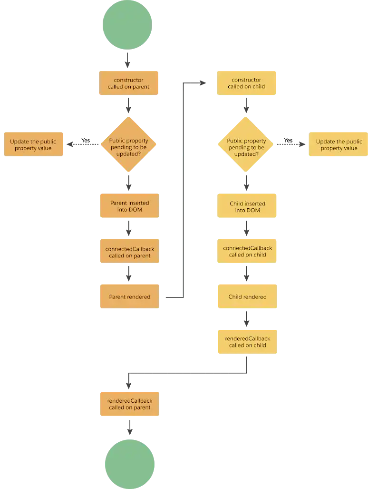

### [SF Book](../README.md)

# Lightning Web Components

- [LWC HTML](SF_LwcHtml.md)
- [LWC JS](SF_LwcJs.md)
- [LWC JS Libraries](SF_LwcJsLibs.md)

## Lifecycle hooks
These hooks are fired at specific points in the component's lifecycle.

| Hook | Description |
| - | - |
| [constructor](https://developer.salesforce.com/docs/platform/lwc/guide/create-lifecycle-hooks-created.html) | Fired before properties are assigned and children created |
| [connectedCallback](https://developer.salesforce.com/docs/platform/lwc/guide/create-lifecycle-hooks-dom.html) | Fired when the component is inserted in the DOM. Used to perform initialization tasks such as fetching data |
| [disconnectedCallback](https://developer.salesforce.com/docs/platform/lwc/guide/create-lifecycle-hooks-dom.html) | Fired when the component is removed from the DOM |
| [renderedCallback](https://developer.salesforce.com/docs/platform/lwc/guide/create-lifecycle-hooks-rendered.html) | Fired after the component has rendered. To execute code the first time the component renders hasRendered can be used. Check documentation to prevent loops |
| [errorCallback](https://developer.salesforce.com/docs/platform/lwc/guide/create-lifecycle-hooks-error.html) | Fired when the component or its children trigger an error |

## Forms
Standard forms can be created:

https://developer.salesforce.com/docs/platform/lwc/guide/data-get-user-input.html

